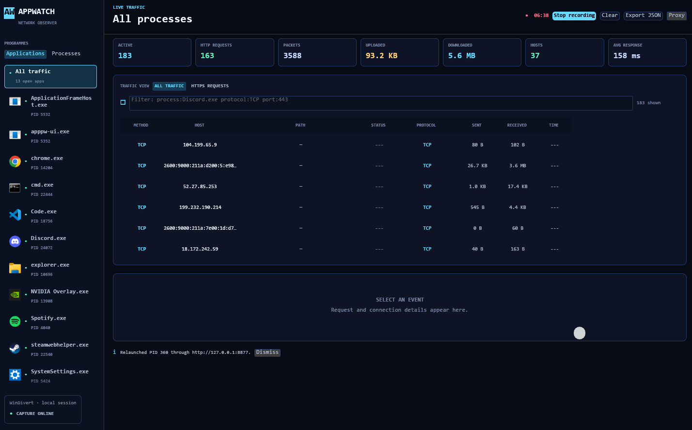

# AppProcessWatcher v0.2

> Windows per-process network traffic monitor and HTTP(S) inspection tool
> built with Rust, egui, Tokio, WinDivert, Hyper, and SQLite.



## Features

- Monitor network traffic by running process
- Live upload/download statistics
- TCP, UDP, and QUIC traffic observation
- Inspect active connections
- HTTP request inspection
- HTTPS inspection through a local MITM proxy
- Persistent local CA certificate
- Chromium / Electron / CEF detection
- Qt WebEngine support
- WebView2 support
- Local traffic/history storage using SQLite

## How It Works

AppProcessWatcher combines packet capture with a local HTTP(S) proxy.

WinDivert captures network traffic and AppProcessWatcher associates packets
with running Windows processes. This provides per-process traffic statistics
without requiring applications to use the proxy.

HTTP(S) inspection is separate. Applications must be launched through the
AppProcessWatcher proxy to inspect application-layer requests.

            ┌─────────────────────┐
            │   Target Process    │
            └──────────┬──────────┘
                       │
             Network traffic
                       │
              ┌────────▼────────┐
              │    WinDivert    │
              └────────┬────────┘
                       │
              Process attribution
                       │
              ┌────────▼────────┐
              │ AppProcessWatcher│
              └─────────────────┘

For HTTP(S) inspection:

Target Process → AppWatch Proxy → Remote Server
                       │
                       └→ Request inspection

## Requirements

- Windows 10/11
- Administrator privileges
- Rust toolchain (when building from source)
- AppWatch CA certificate trusted for HTTPS inspection

## Usage

```text
RUST DESKTOP                                      2026

AppWatch
Rust / egui / Tokio / WinDivert / Hyper / SQLite

> Launch AppWatch with administrator privileges to enable live
	TCP, UDP, and QUIC packet capture.

> Select a running application to inspect its connections and live
	upload/download traffic.

> To capture HTTP and HTTPS requests, trust the AppWatch certificate (it's persistent)
	and relaunch the target application through http://127.0.0.1:8877.

> HTTPS inspection only works for applications using the AppWatch
	proxy. HTTP/3 and QUIC traffic cannot be decrypted.
```

## Chromium-based Apps

The application is still in early development so if you encounter any issues let me know 

When relaunching an application through the proxy, AppWatch checks the executable's
directory and its immediate subdirectories for Chromium, Electron, or CEF files:
`chrome_elf.dll`, `libcef.dll`, `resources/app.asar`, or the `icudtl.dat` and
`resources.pak` pair. A match causes AppWatch to pass `--proxy-server` and
`--disable-quic` directly to the application.

It also detects Qt WebEngine through `Qt5WebEngineCore.dll` or
`Qt6WebEngineCore.dll`, and WebView2 through `WebView2Loader.dll` in its standard
runtime locations. These apps receive the equivalent Chromium flags through their

## HTTPS Inspection

AppProcessWatcher uses a locally generated certificate authority to inspect
HTTPS traffic passing through its proxy.

The CA certificate is persistent and must be explicitly trusted by the user.

Applications using certificate pinning may reject AppProcessWatcher's
generated certificates and therefore cannot be inspected.

## Limitations

- Windows only
- HTTP/3 / QUIC payloads cannot currently be decrypted
- HTTPS inspection requires the target application to use the AppWatch proxy
- Applications using certificate pinning may reject intercepted HTTPS traffic
- Some applications may ignore proxy configuration
- Protocols other than HTTP(S) can be observed at the network level but their
  application payloads are not decoded

## Building

```bash
git clone <repo>
cd AppProcessWatcher
cargo build --release